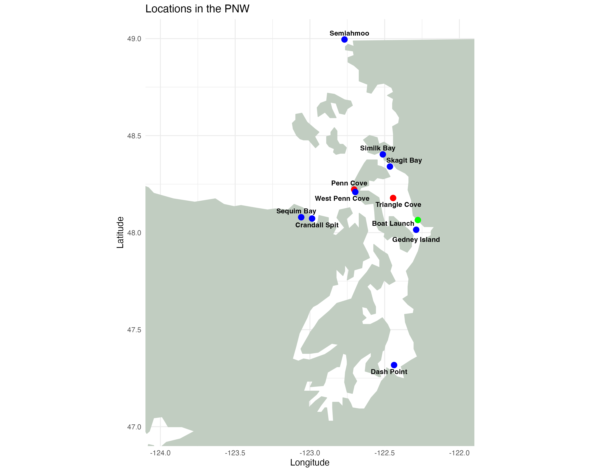
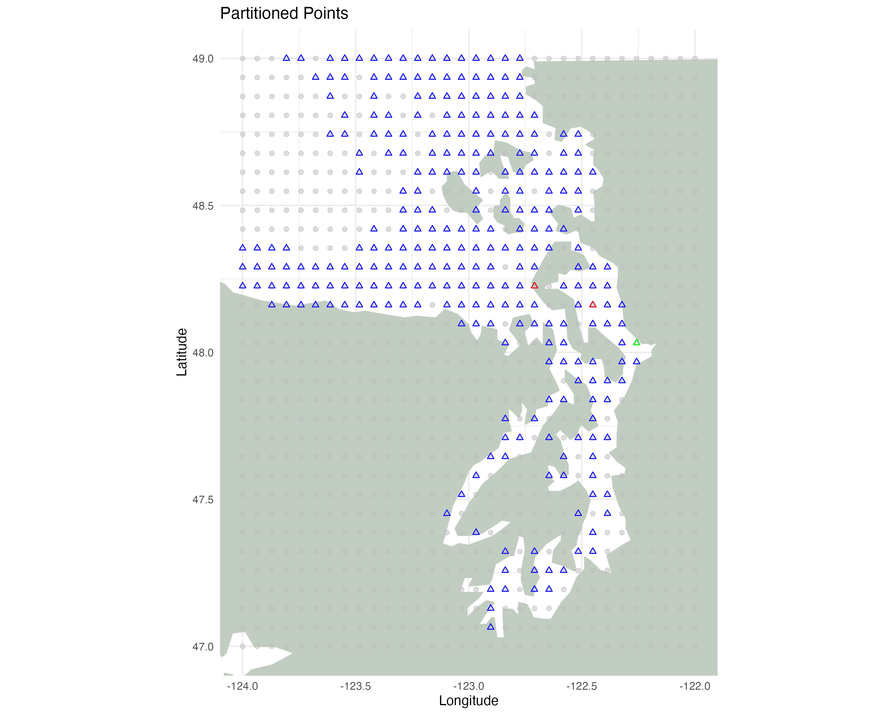
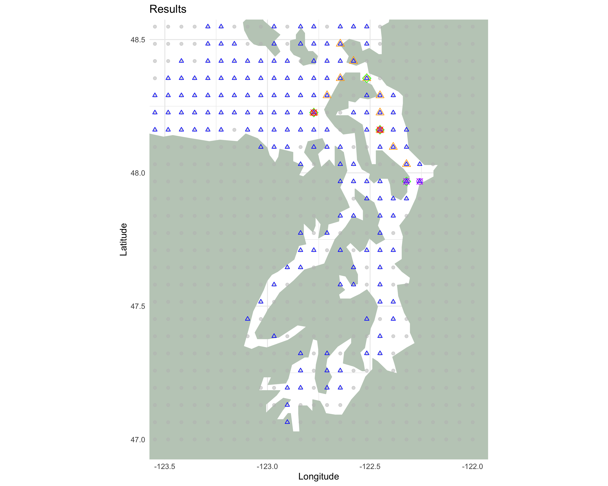

# Optimization Project - Field Sampling Design

Optimal route for eDNA sampling of Bivalve Transmissible Cancer (BTN) throughout the Puget Sound. It integrates R spatial processing, network graph construction, and a Mixed-Integer Linear Program (MILP) formulated in Java.

**Goal:** Design a single closed sampling route that maximizes expected BTN detection while respecting time and travel constraints.
___

## Pipeline Summary
1. Spatial Pre-Processing in R
   * Imports real geographic coordiantes for Washington coastal sites the lab monitors.
   * Builds a grid of possible sampling nodes around the sound.
   * Filters to water-based nodes using 'rnaturalearth' shapefiles.
   * Computes shortest-path distances between grid points using 'sf' geometry and constructs adjacency pairs for all nodes.
   * Calculates risk scores based on distance to two high-BTN sites (provided by Metzger Lab at PNRI) using eDNA measurements.

  
  

2. MILP Model Generation in Java
   * 'final_construct.java' automatically builds a CPLEX/LP file ('model_cycle.lp') representing the optimization problem.
  
     | Variable | Type    | Meaning                              |
| -------- | ------- | ------------------------------------ |
| `x_i`    | binary  | node i is sampled                    |
| `y_i`    | binary  | node i is visited                    |
| `e_ij`   | binary  | travel arc from node i → j           |
| `u_i`    | integer | order variable (subtour elimination) |

  * Constraints
      + Exactly one start node and fixed based on where you can launch your boat for sampling.
      + Each visited node has 1 incoming and 1 outgoing edge.
      + Subtour elimination.
      + Time budget combining travel and sampling costs.
      + Coupling constraints: sampling only if visited.
   
3. Solve Optimization Problem - 'model_cycle_fixed.sol'

4. Visualizaation in R
   * Parse the '.sol' file to extract
       + Selected nodes for path (`y_i`)
       + Selected nodes for smapling (`x_i`)
       + Arcs (`e_ij`)
   * Plot optimized route over map

  
